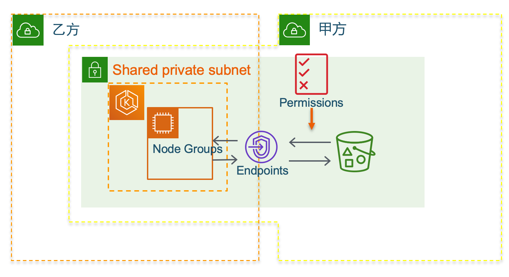

# Data-and-model-isolation-on-EKS
## 介绍
在机器学习中，有一种常见的需求：甲方提供数据，乙方提供机器学习模型。甲方要确保数据不被乙方保存副本，而乙方也要保护自己的机器学习模型不被甲方获取。这种场景借助AWS的三个服务可以轻松实现，这三个服务分别是EKS，AWS Resource Access Manager，AWS Organizations。

如下图，先使用AWS Resource Access Manage，将甲方的一个私有子网共享给乙方。并且对取消私有子网的互联网访问权限，在路由表中添加S3 endpoint，并配置权限，这个私有子网中的EC2实例仅可以访问指定指定S3存储桶。并且也在S3存储桶配置，[必须特定的s3 endpoint才能访问这个存储桶]（https://aws.amazon.com/cn/premiumsupport/knowledge-center/block-s3-traffic-vpc-ip/）。

