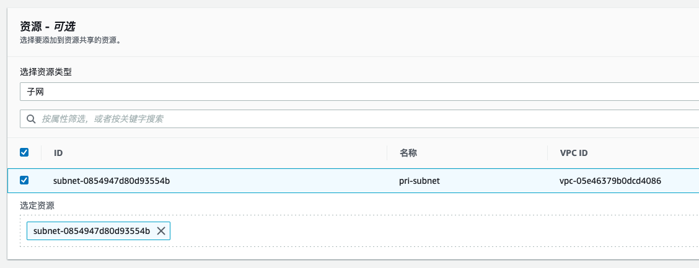

# Data-and-model-isolation-on-EKS
## 介绍
在机器学习中，有一种常见的需求：甲方提供数据，乙方提供机器学习模型。甲方要确保数据不被乙方保存副本，而乙方也要保护自己的机器学习模型不被甲方获取。这种场景借助AWS的三个服务可以轻松实现，这三个服务分别是EKS，AWS Resource Access Manager，AWS Organizations。

如下图，先使用AWS Resource Access Manage，将甲方的一个私有子网共享给乙方。并且对取消私有子网的互联网访问权限，在路由表中添加S3 endpoint，并配置权限，这个私有子网中的EC2实例仅可以访问指定指定S3存储桶。并且也在S3存储桶配置，[必须特定的s3 endpoint才能访问这个存储桶](https://aws.amazon.com/cn/premiumsupport/knowledge-center/block-s3-traffic-vpc-ip/)。然后乙方在自己的VPC内创建EKS集群，选择子网时，则选择甲方共享的子网。这样乙方可以通过在甲方共享的子网内创建机器学习推理集群，访问甲方的数据，但数据不能外传。甲方也无法获得乙方的机器学习模型。最后，再使用AWS Organizations SCP，由甲方控制乙方的权限，禁止乙方快照和挂载EBS，防止利用EKS集群复制数据。

下面来实验下具体操作步骤。

## 第一步，使用Resource Access Manage共享子网

默认VPC的子网是不能被Resource Access Manage共享的，所以需要新创建一个VPC。

进入Resource Access Manage服务页面，选择创建新的共享资源。

如上图，我们选择指定的子网。

如上图，我们可以看到，共享出的子网，对方仅能在上面运行EC2实例，并没有其他权限。

